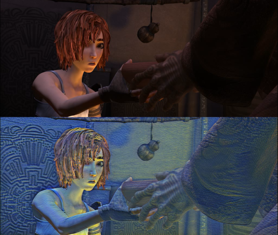
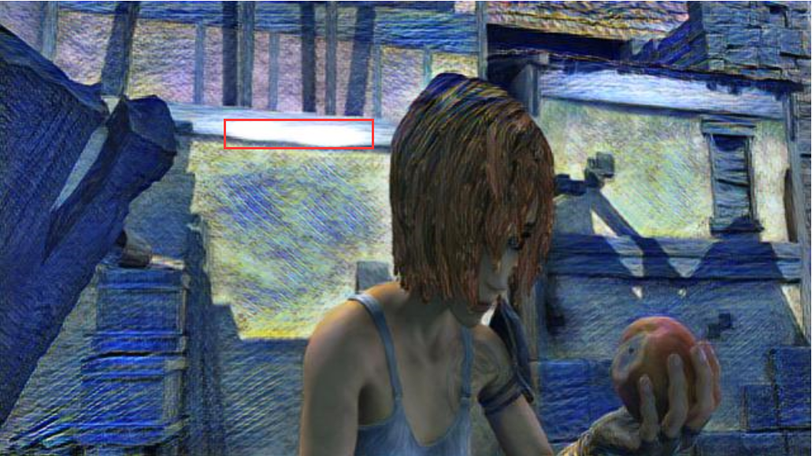

# reconet-torch

## What we did?
1. Modified to do video style transfer.
2. Calculate execution time.

## How to use?

Environment we used:
- [Python 3.10.8]
- [PyTorch 1.13.1]

### Run this code:

#### Training
Example for training with style image `style_images/Under-the-Wave-off-Kanagawa.jpg`:
```
python train.py --phase train --path mpidataset --style-name=style_images/Under-the-Wave-off-Kanagawa.jpg
```
#### Testing

We trained three models, respectively in the following folders:
`trained_models_the-muse/`, `trained_models_wave/`, `trained_models_night/`, `trained_models_Arles/`

Example for testing with style **the-muse** with the input video `content/video_0.mp4`:
```
python video_cv2.py --video-name output/ReCoNet_the-muse_video_0.mp4 --mode video_style --save-directory trained_models\ the-muse/ --model-name train.pt --imgs-path content/video_0.mp4
```

## Our result

- input styles

   

---

## The following content comes from the original Repository.

Reference repository: https://github.com/liulai/reconet-torch

This repository contains a PyTorch implementation of the [ReCoNet paper](https://arxiv.org/pdf/1807.01197.pdf). It use a lot of code from [safwankdb](https://github.com/safwankdb/ReCoNet-PyTorch)

### Contributors:
- [Mohd Safwan](https://github.com/safwankdb)
- [Kushagra Juneja](https://github.com/kushagra1729)
- [Saksham Khandelwal](https://github.com/skq024)
- [safwankdb](https://github.com/safwankdb)

[](videos/output_shaman_1_concat01_10.avi)


## dataset
we use the [MPI Sintel Dataset](http://files.is.tue.mpg.de/sintel/MPI-Sintel-complete.zip). The dataset contains flow fields, motion boundaries, unmatched regions, and image sequences. The image sequences are rendered with different levels of difficulty.

# Train

```bash
python train.py --phase train --path mpidataset --style-name=style_images/vanGogh.jpg
```

# video

```bash
python video_cv2.py --video-name 'avi/output_style.avi' --mode video_style --save-directory trained_models --model-name model.pth
```


### nodes

You can use **optim.Adam()**, it results bubble artifacts in the following red boxes. I used **optim.Adamax()** in my code.

<div align='center'>
  
</div>


